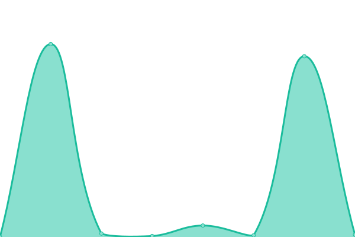
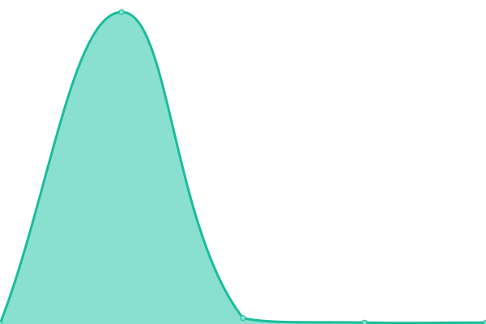
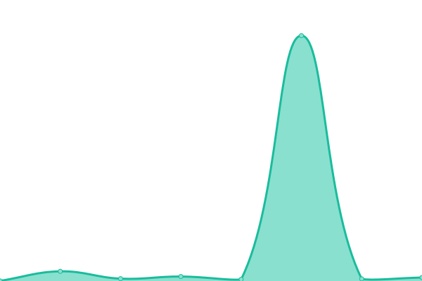

# [📈 Live Status](https://uptime.upcwangying.com): <!--live status--> **🟩 All systems operational**

This repository contains the open-source uptime monitor and status page for [Kimmy](https://uptime.upcwangying.com), powered by [Upptime](https://github.com/upptime/upptime).

With [Upptime](https://upptime.js.org), you can get your own unlimited and free uptime monitor and status page, powered entirely by a GitHub repository. We use [Issues](https://github.com/realkimmy/uptime/issues) as incident reports, [Actions](https://github.com/realkimmy/uptime/actions) as uptime monitors, and [Pages](https://uptime.upcwangying.com) for the status page.

<!--start: status pages-->
<!-- This summary is generated by Upptime (https://github.com/upptime/upptime) -->
<!-- Do not edit this manually, your changes will be overwritten -->
<!-- prettier-ignore -->
| URL | Status | History | Response Time | Uptime |
| --- | ------ | ------- | ------------- | ------ |
|  [GitHub Readme](https://github.gitterapp.com/api/readme?owner=realkimmy&repo=realkimmy) | 🟩 Up | [git-hub-readme.yml](https://github.com/realkimmy/uptime/commits/HEAD/history/git-hub-readme.yml) | 

 1354ms
     
 | 

<a href="https://uptime.upcwangying.com/history/git-hub-readme">100.00%</a>
    

|  [GitHub Pinned](https://github.gitterapp.com/api/pinned?username=realkimmy) | 🟩 Up | [git-hub-pinned.yml](https://github.com/realkimmy/uptime/commits/HEAD/history/git-hub-pinned.yml) | 

 2035ms
     
 | 

<a href="https://uptime.upcwangying.com/history/git-hub-pinned">100.00%</a>
    

|  [GitHub Contributions](https://github.gitterapp.com/api/contributions?username=realkimmy&from=2021-01-01&to=2021-12-31) | 🟩 Up | [git-hub-contributions.yml](https://github.com/realkimmy/uptime/commits/HEAD/history/git-hub-contributions.yml) | 

 2407ms
     
 | 

<a href="https://uptime.upcwangying.com/history/git-hub-contributions">100.00%</a>
    

|  [GitHub Contributions(V2)](https://github.gitterapp.com/api/v2/contributions?username=realkimmy&from=2021-01-01&to=2021-12-31) | 🟩 Up | [git-hub-contributions-v2.yml](https://github.com/realkimmy/uptime/commits/HEAD/history/git-hub-contributions-v2.yml) | 

 1242ms
     
 | 

<a href="https://uptime.upcwangying.com/history/git-hub-contributions-v2">100.00%</a>
    

<!--end: status pages-->

[**Visit our status website →**](https://uptime.upcwangying.com)

## 📄 License

- Powered by: [Upptime](https://github.com/upptime/upptime)
- Code: [MIT](./LICENSE) © [Kimmy](https://uptime.upcwangying.com)
- Data in the `./history` directory: [Open Database License](https://opendatacommons.org/licenses/odbl/1-0/)
