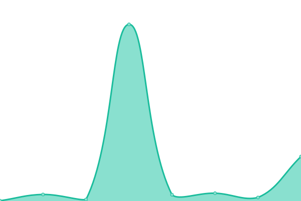

# [📈 Live Status](https://uptime.kimmy.me): <!--live status--> **🟩 All systems operational**

This repository contains the open-source uptime monitor and status page for [Kimmy](https://uptime.kimmy.me), powered by [Upptime](https://github.com/upptime/upptime).

With [Upptime](https://upptime.js.org), you can get your own unlimited and free uptime monitor and status page, powered entirely by a GitHub repository. We use [Issues](https://github.com/see/uptime/issues) as incident reports, [Actions](https://github.com/see/uptime/actions) as uptime monitors, and [Pages](https://uptime.kimmy.me) for the status page.

<!--start: status pages-->
<!-- This summary is generated by Upptime (https://github.com/upptime/upptime) -->
<!-- Do not edit this manually, your changes will be overwritten -->
<!-- prettier-ignore -->
| URL | Status | History | Response Time | Uptime |
| --- | ------ | ------- | ------------- | ------ |
|  [Github Trending Repo](https://api.gitterapp.com/repositories) | 🟩 Up | [github-trending-repo.yml](https://github.com/kw214/uptime/commits/HEAD/history/github-trending-repo.yml) | 

 1494ms
     
 | 

<a href="https://uptime.kimmy.me/history/github-trending-repo">100.00%</a>
    

|  [Github Trending Developer](https://api.gitterapp.com/developers) | 🟩 Up | [github-trending-developer.yml](https://github.com/kw214/uptime/commits/HEAD/history/github-trending-developer.yml) | 

 702ms
     
 | 

<a href="https://uptime.kimmy.me/history/github-trending-developer">100.00%</a>
    

|  [Github Languages](https://api.gitterapp.com/languages) | 🟩 Up | [github-languages.yml](https://github.com/kw214/uptime/commits/HEAD/history/github-languages.yml) | 

 143ms
     
 | 

<a href="https://uptime.kimmy.me/history/github-languages">100.00%</a>
    

|  [Github Spoken Languages](https://api.gitterapp.com/spoken_languages) | 🟩 Up | [github-spoken-languages.yml](https://github.com/kw214/uptime/commits/HEAD/history/github-spoken-languages.yml) | 

 92ms
     
 | 

<a href="https://uptime.kimmy.me/history/github-spoken-languages">100.00%</a>
    

|  [Github Readme](https://github.gitterapp.com/api/readme?owner=kw214&repo=kw214) | 🟩 Up | [github-readme.yml](https://github.com/kw214/uptime/commits/HEAD/history/github-readme.yml) | 

 900ms
     
 | 

<a href="https://uptime.kimmy.me/history/github-readme">99.81%</a>
    

|  [Github Pinned](https://github.gitterapp.com/api/pinned?username=kw214) | 🟩 Up | [github-pinned.yml](https://github.com/kw214/uptime/commits/HEAD/history/github-pinned.yml) | 

 509ms
     
 | 

<a href="https://uptime.kimmy.me/history/github-pinned">100.00%</a>
    

|  [Github Contributions](https://github.gitterapp.com/api/contributions?username=kw214&from=2021-01-01&to=2021-12-31) | 🟩 Up | [github-contributions.yml](https://github.com/kw214/uptime/commits/HEAD/history/github-contributions.yml) | 

 660ms
     
 | 

<a href="https://uptime.kimmy.me/history/github-contributions">100.00%</a>
    

|  [Github Contributions(V2)](https://github.gitterapp.com/api/v2/contributions?username=kw214&from=2021-01-01&to=2021-12-31) | 🟩 Up | [github-contributions-v2.yml](https://github.com/kw214/uptime/commits/HEAD/history/github-contributions-v2.yml) | 

 689ms
     
 | 

<a href="https://uptime.kimmy.me/history/github-contributions-v2">100.00%</a>
    

<!--end: status pages-->

[**Visit our status website →**](https://uptime.kimmy.me)

## 📄 License

- Powered by: [Upptime](https://github.com/upptime/upptime)
- Code: [MIT](./LICENSE) © [Kimmy](https://uptime.kimmy.me)
- Data in the `./history` directory: [Open Database License](https://opendatacommons.org/licenses/odbl/1-0/)
